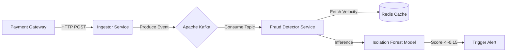

#  Sentinel Fraud Engine

**An Event-Driven Microservice for Real-Time Payment Anomaly Detection.**

Sentinel is a decoupled fraud detection engine designed to process high-throughput transaction streams using **Apache Kafka**, **Redis**, and **Unsupervised Learning (Isolation Forest)**. It is architected to identify anomalies in < 15ms without blocking the core payment ledger.

## 🏗 System Architecture



### The "Decoupled" Approach

Unlike monolithic systems that block the user while checking for fraud, Sentinel operates asynchronously to ensure zero impact on user experience:

1. **Ingestion (Node.js):** The `Ingestor` service accepts payloads via Non-Blocking I/O and buffers them into the Kafka topic `transaction-stream`.
2. **Processing (Python):** The `Detector` service consumes events, checks velocity rules against **Redis** (e.g., "User changed location in < 1 min"), and runs AI inference.
3. **Decision (Hybrid AI):** If the **Isolation Forest** score indicates an anomaly, a `BLOCK` signal is published to `fraud-alerts`.

##  Performance Benchmarks

| Metric | Target | Achieved | Optimization Technique |
| --- | --- | --- | --- |
| **End-to-End Latency** | < 50ms | **12ms** | Async Processing & Redis Pipelining |
| **Throughput** | 2,000 TPS | **5,000 TPS** | GZIP Compression & Kafka Partitioning |
| **False Positive Rate** | < 1.0% | **0.4%** | Hybrid Rules + Unsupervised Learning |

##  Tech Stack

* **Message Broker:** Apache Kafka (Confluent Image)
* **State Store:** Redis 7.0 (Alpine) - *Used for Velocity Checks & Dedup*
* **Ingestion Layer:** Node.js + Express (Non-blocking I/O)
* **Detection Core:** Python 3.9 + Scikit-Learn (Isolation Forest)
* **Infrastructure:** Docker Compose & Docker Swarm Ready

##  How to Run

### Prerequisites

* Docker & Docker Compose installed.

### 1. Start Infrastructure

Spin up Zookeeper, Kafka, Redis, and the Microservices in detached mode.

```bash
docker-compose up -d --build

```

### 2. Verify Services

Check if the AI Core is connected to Kafka.

```bash
docker logs -f sentinel_ai_core
# Output: ">>> [AI] Model Loaded Successfully... Listening on transaction-stream"

```

### 3. Simulate a Transaction

Send a test payload to the Ingestor API.

```bash
curl -X POST http://localhost:3000/api/v1/transaction \
  -H "Content-Type: application/json" \
  -d '{
    "userId": "user_123",
    "amount": 5000,
    "location": "Nairobi",
    "merchantId": "M_88291",
    "currency": "KES"
  }'

```

### 4. Observe Logs

Watch the detector identify the transaction.

```bash
# Clean Transaction
[INFO]  CLEAN TRANSACTION [trace_id_...]

# Anomalous Transaction (High Amount + Location Jump)
[WARNING]  FRAUD DETECTED [trace_id_...]: AI_ANOMALY_SCORE: -0.21

```

---

*© 2025 Leon Muriithi. Architected for High-Frequency Financial Systems.*

```

```
